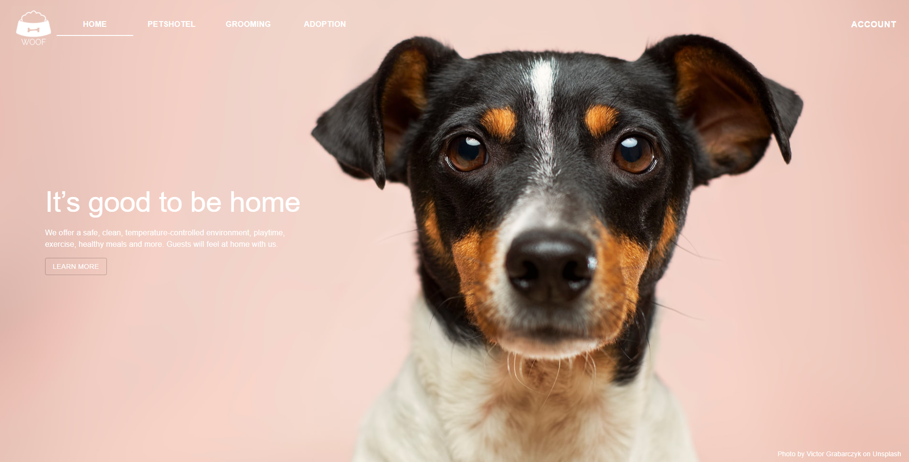
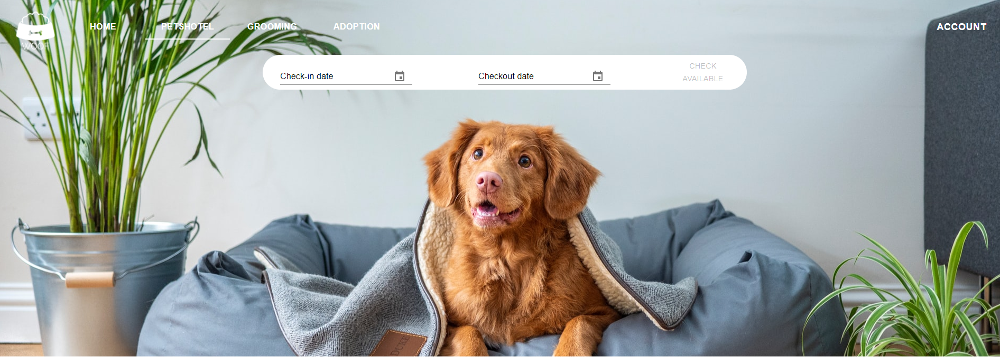
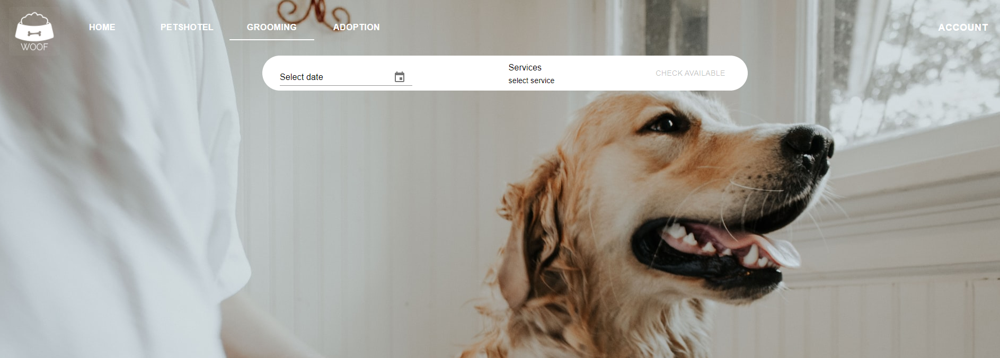
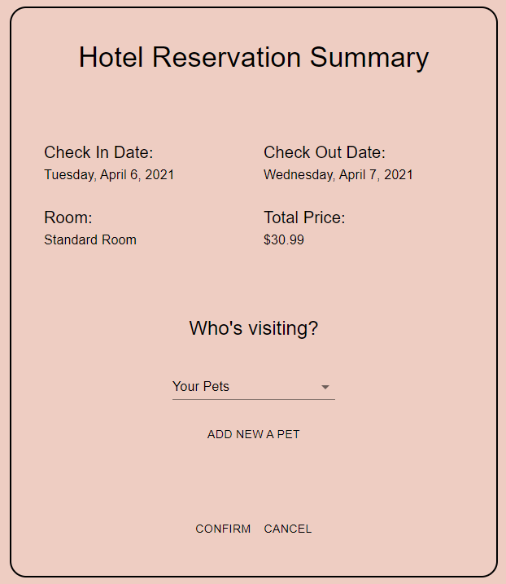
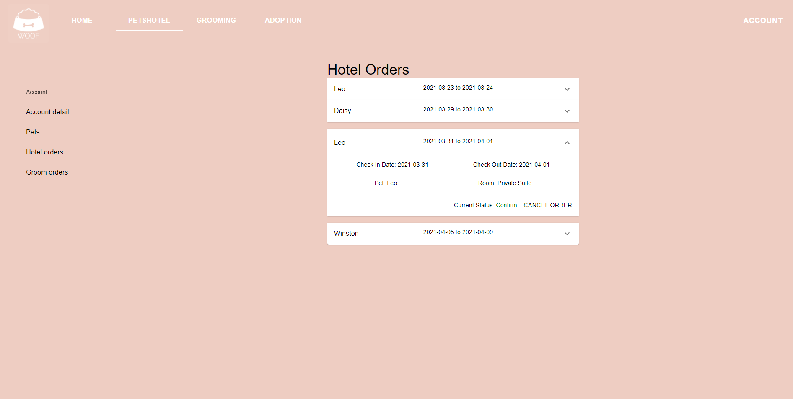
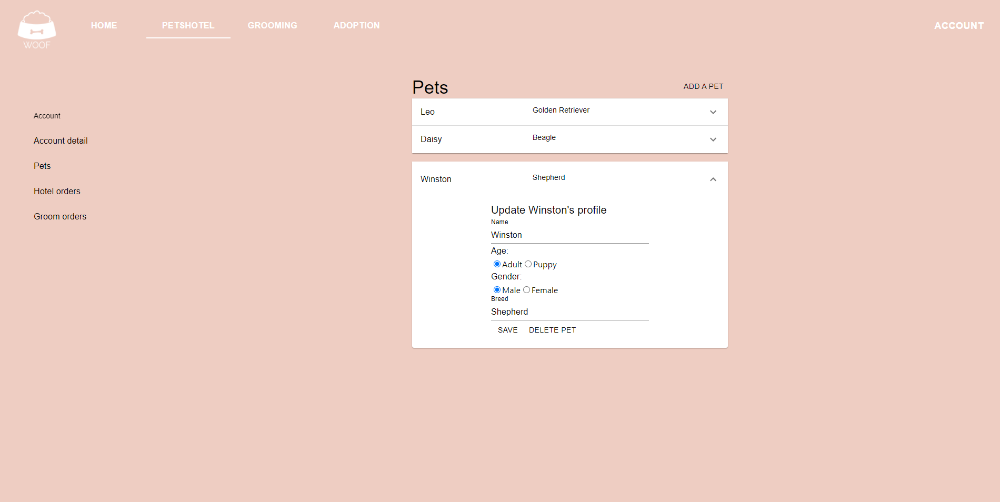

# Pet Hotel and Grooming
Pet hotel and grooming is an online booking application for a local pet store to make reservations and manage orders.

## Table of contents
* [General info](#General-info)
* [Technologies](#Technologies)
* [Setup](#Setup)


## General-info
<p align="center">

<p>
1. Checking available hotel rooms or grooming service at selected time period.
<p align="center">

<p>
<p align="center">

<p>
2. Making reservations for pet hotel or grooming service.
<p align="center">

<p>
3. Managing reservations, pets, and profile.
<p align="center">

<p>
<p align="center">

<p>
4. Adopting dogs.


## Technologies
Project is created with:
* React version: 17.0.1
* Django version: 3.1.7
* Django Rest Framework version: 3.12.2

## Setup
#### Frontend 
```bash
npm install
npm start
```

#### Backend 
```bash
Install the project dependencies:
pip install -r requirements.txt
then:
python manage.py migrate
create admin account:
python manage.py createsuperuser
then:
python manage.py makemigrations
python manage.py migrate
to start the development server:
python manage.py runserver
```
